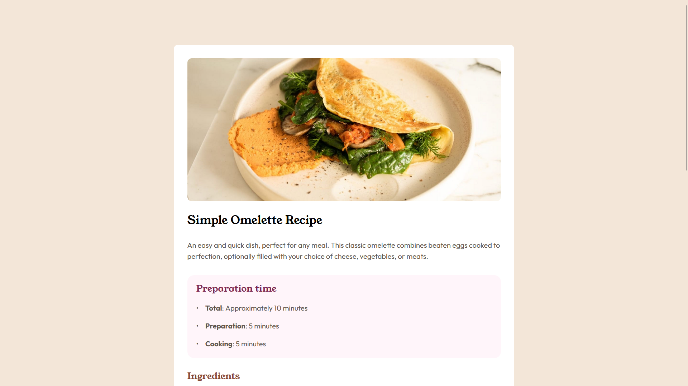
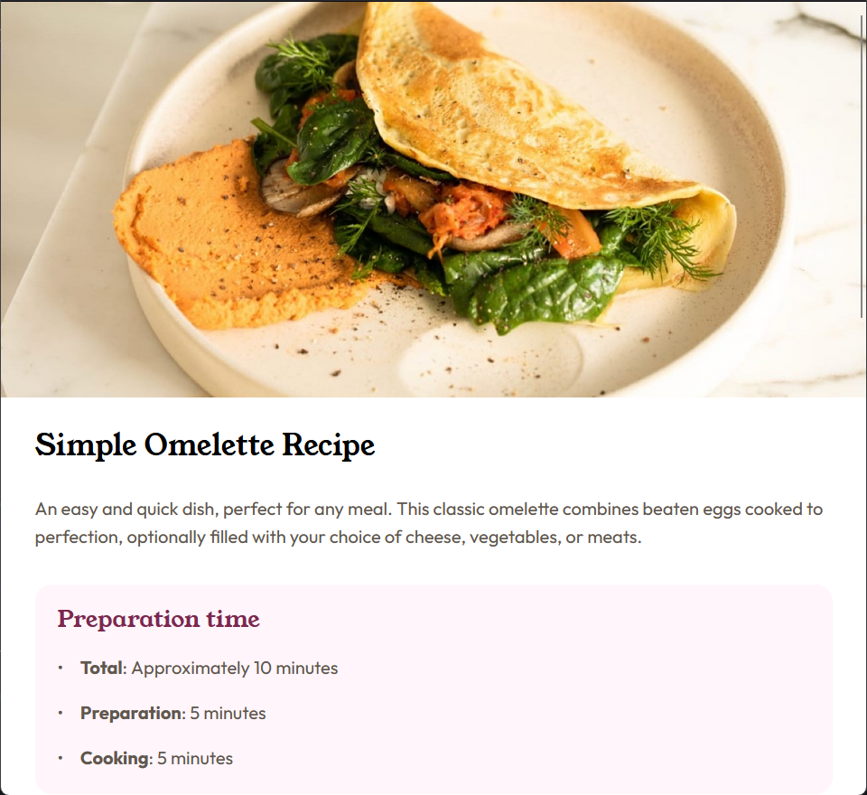

# Frontend Mentor - Recipe page solution

This is a solution to the [Recipe page challenge on Frontend Mentor](https://www.frontendmentor.io/challenges/recipe-page-KiTsR8QQKm). Frontend Mentor challenges help you improve your coding skills by building realistic projects. 

## Table of contents

- [Overview](#overview)
  - [The challenge](#the-challenge)
  - [Screenshot](#screenshot)
  - [Links](#links)
- [My process](#my-process)
  - [Built with](#built-with)
  - [What I learned](#what-i-learned)
  - [Continued development](#continued-development)
  - [Useful resources](#useful-resources)
- [Author](#author)

## Overview

### Screenshot

### Links

- Solution URL: [Solution URL](https://github.com/AlbertoSocorro/recipe-page-main)
- Live Site URL: [Live site URL](https://albertosocorro.github.io/recipe-page-main/)

## My process

### Built with

- Semantic HTML5 markup
- CSS custom properties
- Flexbox
- CSS Grid
- Visual Studio

### What I learned

Como tuve que cambiar la apariencia cuando el ancho de la pantalla bajase de cierto tamaño, tuve que aprender a utilizar la propiedad @media, y ahora creo que la se utilizar bastante bien. Tambien aprendi a utilizar la grid box.

### Continued development

Creo que en este proyecto me ha sido mas dificil mantener cierto orden en la estructura de la pagina, por lo que en proyectos posteriores tengo que concentrarme mas en que la pagina este bien estructurada.

### Useful resources

No he recurrido a internet en la elaboracion de este ejercicio.

## Author

- Frontend Mentor - [@AlbertoSocorro](https://www.frontendmentor.io/profile/albertosocorro)
